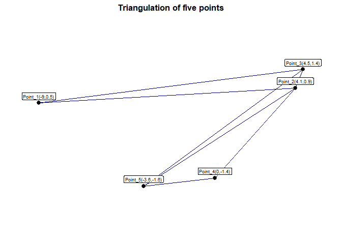

<!-- README.md is generated from README.Rmd. Please edit that file -->

# Triangulate

<!-- badges: start -->
<!-- badges: end -->

This is a small R package that provides functions for triangulating five
points into three triangles. It includes a triangulation function, a
plotting utility and example datasets

## Installation

You can install the development version of Triangulate from
[GitHub](https://github.com/) with:

``` r
# install.packages("pak")
pak::pak("gkagyen/Triangulate")
```

## Features

**`triangulate()`**: This function connects five points (given a 5x2
matrix) into three triangles returning a list with the points and edges
**`plot_triangles()`**: This function helps to visualise the
triangulation using `ggplot2`, labelling points with their respective
coordinates **Example datasets**: Two built-in 5x2 matrices
(`sample_data1` and `sample_data2`) for demonstration

## Example Usage

Here is a quick example to triangulate and plot five points

``` r
library(Triangulate)

# create a 5x2 matrix of points
points <- matrix(c(0,0,1,1,2,0,3,1,4,0), nrow = 5, byrow = TRUE)

# apply triangulation
tri_obj <- triangulate(points)

# visualise triangulation
tri_show <- plot_triangles(tri_obj)
print(tri_show)
```


### Using In-Built Datasets

``` r
sample_data1
#>             x        y
#> [1,] 3.992223 4.210237
#> [2,] 9.515923 4.676918
#> [3,] 5.431508 6.132936
#> [4,] 7.627956 2.377114
#> [5,] 5.508387 2.546702
plot_triangles(triangulate(sample_data1))
```


``` r

sample_data2
#>              x          y
#> [1,] -3.688526  0.6262307
#> [2,]  6.685532 -2.1271964
#> [3,]  8.487249 -0.6811584
#> [4,]  4.365835  0.1319151
#> [5,]  9.884388 -0.8479281
plot_triangles(triangulate(sample_data2))
```



## Motivations

This package was developed as part of the ***Google Summer of Code
2025*** application under the R projects’ **“Create an R Code only
version of the `tripack` functions”** project
